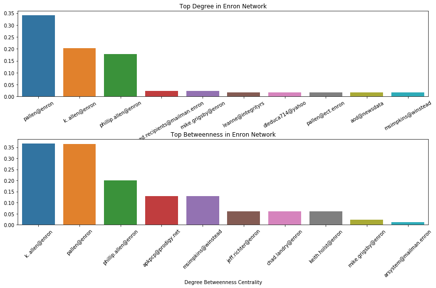

# jsheld
## As a simple demo we look at the graph network generated by ~500,000 emails from the Enron corporation. 
https://www.kaggle.com/wcukierski/enron-email-dataset

 
 

## We can thus compute various graph-based metrics for structure
 
# enron-emails
